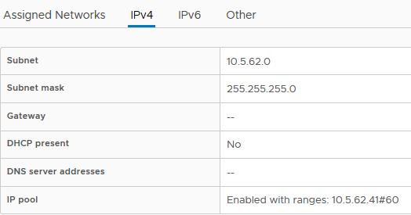

# Rancher on vSphere and HPE Nimble

## Warning

This branch leverages VMWare network profiles. The vSphere Network profiles are required for the user cluster(s) to be deployed successfully. The advantage of using vSphere Network profile is that the playbooks can be used in environments where DHCP cannot be deployed on the VLAN (or VLANs) the solution requires. These VLANs are:

- The Rancher Management Network. All VMs the playbooks deploy are connected to this network. This includes the infrastructure VMs and the VMs deployed by Rancher when a user cluster is deployed (or scaled up). Rancher manages the VMs (and the Kubernetes clusters running on the VMs) using this network/VLAN. The corresponding subnet of this VLAN is `rancher_subnet`. The corresponding VMware portgroup is designated with the variables `vm_portgroup`. If the name of the `vm_portgroup` is - say - **DCN**, the network profile must be named with the same name **DCN** and the network profile must specify a pool of IP addresses that the solution can use.
- Potentially, any additional dedicated iSCSI network (when using the HPE Nimble CSI driver for example). There can be up to two additional iSCSI networks. These networks are configured with `user_cluster.iscsi1_portgroup` and `user_cluster.iscsi2_portgroup`. If the variable is defined, then it designates the (existing) VMware portgroup to use and the VM deployed by Rancher will be connected to this portgroup by the `user.yml` playbook. Thus, if you define `user_cluster.iscsi1_portgroup` and set it to - say - myiscsi1, then you **must** define a network profile with the same name myiscsi1 and this network profile must specify a pool of IP addresses that the solution can use.

**Note:** The IP addresses for the infrastructure VMs (load balancers, Rancher control plane VMs, support node) are configured in the Ansible inventory itself (the `hosts` file). The playbooks do not use VMWare Network Profiles for these VMs because they are under the direct control of Ansible. 

**Example**

Excerpt from `group_vars/all/vars.yml`

```
rancher_subnet: 16.78.0.0/19
vm_portgroup: DCN
gateway: '16.78.0.1'
dns_servers: ['16.78.15.31']
dns_suffixes: ['k8s.org','flab.local']
domain_name: k8s.org
   :      :
user_cluster:
   :       :
  iscsi_portgroup: iSCSI2

```


Below is the network profile defined for the Rancher management network (DCN). Note that the subnet, gateway and DNS server are the same as those defined in `group_vars/all/vars.yml` as shown above


And thereafter is the network profile configured for the first iSCSI dedicated network (designated by `user_cluster.iscsi1_portgroup`) 



**Note:** If you want to specify only one dedicated iSCSI network configure `user_cluster.iscsi1_portgroup`. If you want to configure two dedicated iSCSI networks, configure `user_cluster.iscsi1_portgroup` and `user_cluster.iscsi2_portgroup`.  Do not configure `user_cluster.iscsi2_portgroup` alone.

## Preparation Steps

1.  Make sure you have configured the vSphere network profiles as indicated earlier. Make sure all datastores and portgroups that you name in `group_vars/all/vars.yml` are existing in the datacenter.

2. Create the file `group_vars/all/vars.yml` based on the file `vars.yml.sample` in the same folder

3. Create the file `group_vars/all/vault.yml` using the sample file found in the same folder

4. Edit/Creates a file named `hosts` based on the sample Ansible inventory provided (`hosts.sample`)

5. Deploy an RKE cluster with Rancher Server

   ```bash
   $ ansible-playbook -i hosts site.yml
   ```

6. If you use the HPE Nimble CSI driver **create a folder in your Nimble array** default pool matching the name of the user cluster. This name is specified with the environment variable USER_CLUSTER_TAG (see below)

7. Deploy the user cluster with the name dev (for example) using

   ```bash
   $ export USER_CLUSTER_TAG=dev
   $ ansible-playbook -i hosts user.yml
   ```

## Post installation steps

Finally, If you want to access the apps you deploy in the user clusters you will have to create a wildcard DNS name in your DNS infra. The name should point to a load balancer which distributes the traffic across the worker nodes in the user cluster (production use) or to one of the worker nodes if you don't have a load balancer (dev/test)

**example**:

In this example, the wildcard DNS was created to resolve with the IP address of the first (and only) worker node in the cluster


